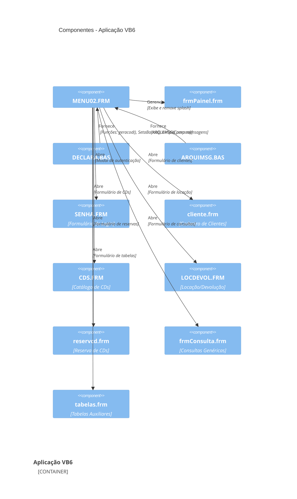
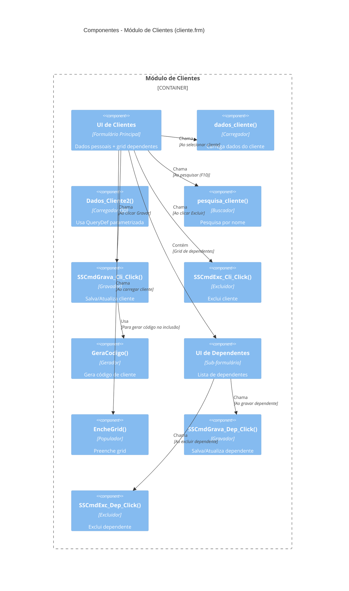
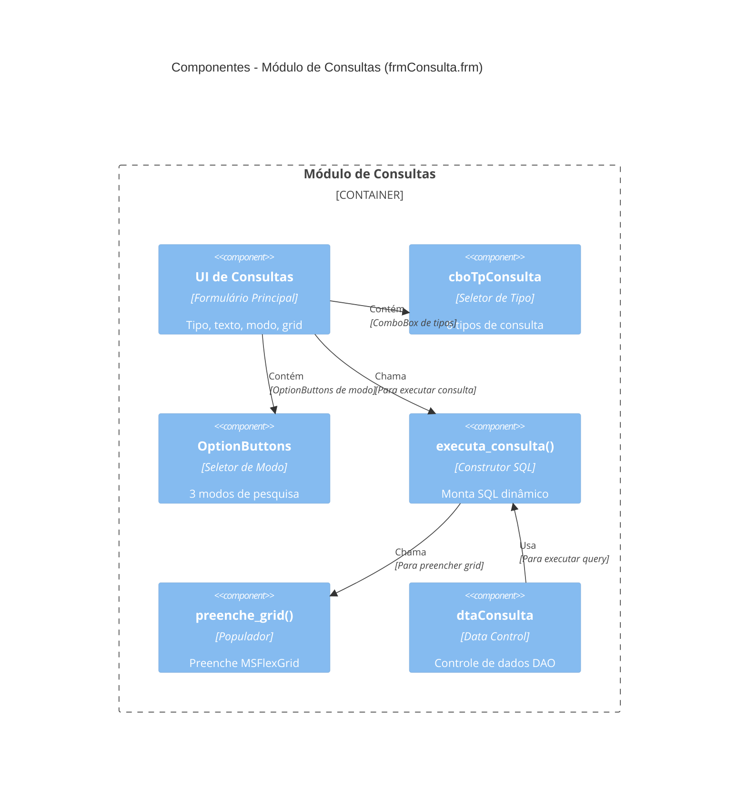

# C4 Components — CDsLoc

> Gerado pelo Reversa em 2026-05-08
> Diagrama de componentes do sistema de locação de CDs (Nível 3)

---

## Descrição dos Componentes

Este detalhamento foca nos componentes internos dos containers mais relevantes do sistema, especialmente a Aplicação VB6 e seus módulos principais.

---

## Componentes da Aplicação VB6



---

## Componentes do Módulo Global (DECLARA.BAS)

```mermaid
C4Component
    title Componentes - Módulo Global (DECLARA.BAS)

    Component_Boundary(global_mod, "DECLARA.BAS - Módulo Global") {
        Component(banco_init, "SetaBanco()", "Inicialização do Banco", "Abre BD e recordsets globais")
        Component(cod_gen, "geracod()", "Gerador de Códigos", "Gera próximo ID sequencial")
        Component(error_handler, "trata_errobd()", "Tratamento de Erros", "Captura erros de banco")
        Component(field_cleaner, "LimpaCampos()", "Limpeza de Campos", "Limpa controles do formulário")
        Component(recibo_print, "imprimir_recibo()", "Impressão de Recibo", "🔴 Não implementado")
    }

    Component_Boundary(db_vars, "Variáveis Globais de Banco") {
        Component(wbanco, "wbanco", "Conexão Principal", "Database object")
        Component(wclien, "wclien", "Recordset Cliente", "Tabela Cliente")
        Component(Wcdfisico, "Wcdfisico", "Recordset CD", "Tabela CD")
        Component(Wlocacao, "Wlocacao", "Recordset Locação", "Tabela Locação")
        Component(Wreserva, "Wreserva", "Recordset Reserva", "Tabela Reserva")
        Component(other_rs, "...", "Outros Recordsets", "8+ tabelas adicionais")
    }

    Rel(banco_init, wbanco, "Cria", "Conexão DAO")
    Rel(banco_init, wclien, "Abre", "Recordset Cliente")
    Rel(banco_init, Wcdfisico, "Abre", "Recordset CD")
    Rel(banco_init, Wlocacao, "Abre", "Recordset Locação")
    Rel(banco_init, Wreserva, "Abre", "Recordset Reserva")

    Rel(cod_gen, wclien, "Usa", "Para gerar código de cliente")
    Rel(cod_gen, Wcdfisico, "Usa", "Para gerar código de CD")
    Rel(cod_gen, Wlocacao, "Usa", "Para gerar código de locação")
    Rel(cod_gen, Wreserva, "Usa", "Para gerar código de reserva")
```

---

## Componentes do Módulo de Autenticação (SENHA.FRM)

```mermaid
C4Component
    title Componentes - Módulo de Autenticação (SENHA.FRM)

    Container_Boundary(auth_mod, "Módulo de Autenticação") {
        Component(login_ui, "Formulário", "Interface de Login", "Campo de senha + checkbox")
        Component(crypt_func, "codigo()", "Criptografia XOR", "Codifica/decodifica senha")
        Component(validator, "Validação", "Verificador de Senha", "Compara com banco")
        Component(attempt_counter, "Contador", "Controle de Tentativas", "Máximo 3 tentativas")
        Component(password_changer, "Troca de Senha", "Alteração de Senha", "Confirmação dupla")
    }

    Rel(login_ui, crypt_func, "Chama", "Para codificar senha digitada")
    Rel(crypt_func, validador, "Fornece", "Senha codificada")
    Rel(validator, attempt_counter, "Usa", "Para contar tentativas")
    Rel(login_ui, password_changer, "Chama", "Se checkbox marcado")
    Rel(password_changer, crypt_func, "Usa", "Para codificar nova senha")
```

---

## Componentes do Módulo de Clientes (cliente.frm)



---

## Componentes do Módulo de CDs (CDS.FRM)

```mermaid
C4Component
    title Componentes - Módulo de CDs (CDS.FRM)

    Container_Boundary(cds_mod, "Módulo de CDs") {
        Component(tabs, "SSTab", "Controle de Abas", "3 abas: Títulos, Músicas, CDs")

        Component_Boundary(tit_tab, "Aba Títulos") {
            Component(tit_ui, "UI de Títulos", "Formulário de Títulos", "Dados do título")
            Component(tit_loader, "dados_titulo()", "Carregador", "Carrega dados do título")
            Component(tit_qdef, "dados_tit2()", "Carregador QD", "Usa QueryDef")
            Component(tit_searcher, "pesq_titulo()", "Buscador", "Pesquisa título")
            Component(tit_saver, "SSCmdGrava_Tit_Click()", "Gravador", "Salva/Atualiza")
            Component(tit_deleter, "SSCmdExc_Tit_Click()", "Excluidor", "Exclui título")
        }

        Component_Boundary(mus_tab, "Aba Músicas") {
            Component(mus_ui, "UI de Músicas", "Formulário de Músicas", "Dados da música")
            Component(mus_loader, "Carregador", "Carrega dados da música")
            Component(mus_saver, "Gravador", "Salva/Atualiza")
            Component(mus_deleter, "Excluidor", "Exclui música")
        }

        Component_Boundary(cd_tab, "Aba CDs Físicos") {
            Component(cd_ui, "UI de CDs", "Formulário de CDs", "Dados do CD físico")
            Component(cd_loader, "dados_cd()", "Carregador", "Carrega dados do CD")
            Component(cd_saver, "SSCmdGrava_Cd_Click()", "Gravador", "Salva/Atualiza")
            Component(cd_deleter, "SSCmdExc_Cd_Click()", "Excluidor", "Exclui CD")
        }
    }

    Rel(tabs, tit_tab, "Contém", "Aba de Títulos")
    Rel(tabs, mus_tab, "Contém", "Aba de Músicas")
    Rel(tabs, cd_tab, "Contém", "Aba de CDs")
```

---

## Componentes do Módulo de Locação (LOCDEVOL.FRM)

```mermaid
C4Component
    title Componentes - Módulo de Locação (LOCDEVOL.FRM)

    Container_Boundary(loc_mod, "Módulo de Locação") {
        Component(tabs, "SSTab", "Controle de Abas", "3 abas: Locação, Devolução, Recibo")

        Component_Boundary(loc_tab, "Aba Locação") {
            Component(loc_ui, "UI de Locação", "Formulário Principal", "Cliente, CD, Tipo")
            Component(loc_cleaner, "limpa_loc()", "Limpeza", "Limpa campos")
            Component(cli_searcher, "pesquisa_cliente()", "Buscador", "Busca cliente")
            Component(res_searcher, "pesquisa_reserva()", "Buscador", "Busca reservas")
            Component(loc_saver, "SSCmdGrava_Loc_Click()", "Gravador", "Grava locação")
            Component(cd_adder, "SSCmdGravaCD_Loc_Click()", "Adicionador", "Adiciona CD à lista")
            Component(date_calc, "Cálculo de Data", "Calculador", "Data prevista 24h/48h")
            Component(val_calc, "Cálculo de Valor", "Calculador", "Valor da locação")
        }

        Component_Boundary(dev_tab, "Aba Devolução") {
            Component(dev_ui, "UI de Devolução", "Formulário de Devolução", "Recibos pendentes")
            Component(dev_cleaner, "limpa_dev()", "Limpeza", "Limpa campos")
            Component(receipt_searcher, "cons_recibo()", "Buscador", "Busca recibos")
            Component(dev_saver, "SSCmdGrava_Dev_Click()", "Gravador", "Registra devolução")
            Component(fine_calc, "Cálculo de Multa", "🔴 Calculador", "Multas por atraso (não encontrado)")
        }

        Component_Boundary(rec_tab, "Aba Recibo") {
            Component(rec_ui, "UI de Recibo", "Formulário de Recibo", "Detalhes do recibo")
            Component(rec_cleaner, "limpa_rec()", "Limpeza", "Limpa campos")
            Component(rec_viewer, "SSCmdVer_Rec_Click()", "Visualizador", "Exibe recibo")
            Component(rec_saver, "grava_recibo()", "Gravador", "Grava recibo")
            Component(rec_printer, "SSCmdImp_Rec_Click()", "Impressor", "Imprime recibo")
        }
    }

    Rel(tabs, loc_tab, "Contém", "Aba de Locação")
    Rel(tabs, dev_tab, "Contém", "Aba de Devolução")
    Rel(tabs, rec_tab, "Contém", "Aba de Recibo")

    Rel(loc_ui, cli_searcher, "Chama", "Para buscar cliente")
    Rel(loc_ui, res_searcher, "Chama", "Para buscar reservas")
    Rel(loc_ui, loc_saver, "Chama", "Para gravar locação")
    Rel(loc_ui, cd_adder, "Chama", "Para adicionar CD")
    Rel(loc_saver, date_calc, "Usa", "Para calcular data prevista")
    Rel(loc_saver, val_calc, "Usa", "Para calcular valor")

    Rel(dev_ui, receipt_searcher, "Chama", "Para buscar recibo")
    Rel(dev_ui, dev_saver, "Chama", "Para registrar devolução")
    Rel(dev_saver, fine_calc, "Usa", "Para calcular multa (🔴)")
```

---

## Componentes do Módulo de Consultas (frmConsulta.frm)



---

## Matriz de Dependências Entre Componentes

| Componente | Depende De | Tipo de Dependência |
|------------|------------|---------------------|
| SENHA.FRM | DECLARA.BAS | Variáveis globais, SetaBanco() |
| cliente.frm | DECLARA.BAS | geracod(), LimpaCampos(), wclien, Wdependente |
| cliente.frm | ARQUIMSG.BAS | ARQUIMSG() para mensagens |
| CDS.FRM | DECLARA.BAS | geracod(), Wcdfisico, Wtitulo, Wmusica |
| LOCDEVOL.FRM | DECLARA.BAS | geracod(), Wlocacao, Wrecibo, Wcdfisico |
| LOCDEVOL.FRM | CRYSTL32.OCX | Impressão de recibos |
| reservcd.frm | DECLARA.BAS | geracod(), Wreserva, Wtitulo |
| frmConsulta.frm | DECLARA.BAS | Variáveis globais |
| tabelas.frm | DECLARA.BAS | geracod(), Recordsets de tabelas auxiliares |
| MENU02.FRM | Todos os formulários | Abre/gerencia janelas filhas |

---

## Observações

🟢 **Boas Práticas Identificadas:**

1. **Centralização de Funções Utilitárias:** DECLARA.BAS concentra funções reutilizáveis
2. **Mensagens Externalizadas:** ARQUIMSG.BAS separa mensagens do código
3. **Padrão Consistente:** CRUD segue o mesmo padrão em todos os formulários

🔴 **Problemas Identificados:**

1. **Variáveis Globais:** Uso extensivo de recordsets globais (acoplamento alto)
2. **Lógica Misturada:** Regras de negócio nos eventos de formulário
3. **Função Não Implementada:** imprimir_recibo() está vazia
4. **Cálculo de Multa Ausente:** Não encontrado código explícito
5. **Sem Testes:** Não há componentes de teste
