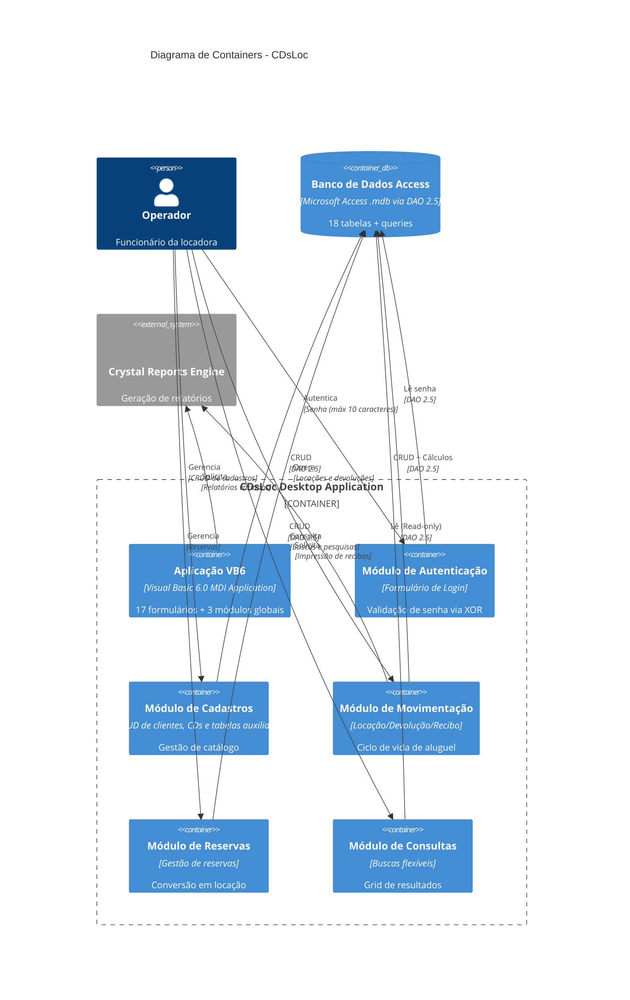

# C4 Containers — CDsLoc

> Gerado pelo Reversa em 2026-05-08
> Diagrama de containers do sistema de locação de CDs (Nível 2)

---

## Descrição dos Containers

O sistema CDsLoc é composto por um único aplicativo desktop que se comunica diretamente com o banco de dados Access e o motor de Crystal Reports.

---

## Diagrama C4 Containers

---

## Detalhamento dos Containers

### Aplicação VB6 (app)

**Descrição:** Aplicação desktop principal desenvolvida em Visual Basic 6.0.

**Tecnologia:** Visual Basic 6.0, MDI (Multiple Document Interface)

**Componentes:**
- 17 formulários (.frm)
- 16 arquivos de recursos (.frx)
- 3 módulos de código (.bas)
- 12 controles OCX ActiveX

**Responsabilidades:**
- Orquestrar todos os módulos do sistema
- Gerenciar ciclo de vida da aplicação
- Prover interface MDI para janelas filhas

---

### Módulo de Autenticação (auth_module)

**Descrição:** Formulário de login que controla acesso ao sistema.

**Arquivo:** SENHA.FRM

**Funcionalidades:**
- Capturar senha do usuário
- Validar senha via XOR
- Permitir alteração de senha (com confirmação dupla)
- Limitar a 3 tentativas antes de encerrar

**Tabela Relacionada:** `senha`

**Características:**
- Senha máxima: 10 caracteres
- Criptografia: XOR com chave 255 (inseguro)
- Sem identificação individual de usuários

---

### Módulo de Cadastros (cadastro_module)

**Descrição:** Gestão completa de cadastros do sistema.

**Arquivos:** cliente.frm, CAD_DEP.FRM, CDS.FRM, tabelas.frm

**Funcionalidades:**
- Cadastro de clientes (com dependentes)
- Cadastro de CDs (títulos, músicas, exemplares físicos)
- Tabelas auxiliares (intérpretes, grupos, estilos, bairros, municípios)

**Tabelas Relacionadas:**
- `Cliente`, `dependente`, `Bairro`, `Municipio`
- `titulo`, `musica`, `cd`
- `interprete`, `grupo`, `estilo`
- `titulo-interprete`, `titulo-musica`, `musica-interprete`

**Características:**
- CRUD completo
- Geração automática de códigos sequenciais
- Validação de campos obrigatórios
- Tratamento de integridade referencial

---

### Módulo de Movimentação (mov_module)

**Descrição:** Gerencia todo o ciclo de vida de locação de CDs.

**Arquivo:** LOCDEVOL.FRM

**Funcionalidades:**
- Locação de CDs (seleção de cliente, CDs, tipo)
- Devolução de CDs (com cálculo de multa)
- Emissão de recibos

**Tabelas Relacionadas:**
- `locacao`, `recibo`, `cd`, `Cliente`, `dependente`

**Características:**
- Cálculo automático de data prevista (24h/48h)
- Atualização de estado do CD
- Suporte a retirada por dependentes
- 🔴 Cálculo de multa não encontrado explicitamente

---

### Módulo de Reservas (reserva_module)

**Descrição:** Gestão de reservas de CDs por clientes.

**Arquivos:** reservcd.frm, CONSRES1.frm, CONSRES2.frm, CONSRES3.frm

**Funcionalidades:**
- Criar reservas de títulos
- Consultar reservas por cliente
- Cancelar reservas
- Converter reserva em locação

**Tabela Relacionada:** `reserva`

**Características:**
- Reserva por título, não por CD físico
- Não garante disponibilidade na retirada
- Múltiplas reservas permitidas para mesmo título

---

### Módulo de Consultas (consulta_module)

**Descrição:** Sistema de consultas genéricas e flexíveis.

**Arquivo:** frmConsulta.frm

**Funcionalidades:**
- Consultas em 6 tipos de tabela (Títulos, Músicas, CDs, Clientes, Locações, Reservas)
- 3 modos de pesquisa: substring, exata, prefixo
- Exibição em grid (MSFlexGrid)
- Apenas leitura

**Características:**
- SQL dinâmico
- Case-insensitive
- Redimensionamento de colunas

---

### Banco de Dados Access (access_db)

**Descrição:** Arquivo Microsoft Access que armazena todos os dados do sistema.

**Tecnologia:** Microsoft Access via DAO 2.5 (Jet Engine)

**Arquivo:** BD_CDLOC.mdb (produção) + BD_CDLOC_Desenv.mdb (desenvolvimento)

**Tabelas:**
- **Negócio:** Cliente, dependente, cd, locacao, recibo, reserva, titulo, musica, interprete
- **Relacionamento:** titulo-interprete, musica-interprete, titulo-musica
- **Auxiliares:** Bairro, Municipio, grupo, estilo, senha, valor_loc

**Características:**
- Acesso direto via DAO (sem camada de abstração)
- QueryDefs para consultas parametrizadas
- Integridade referencial (erro 3200)
- Sem controle de transações explícito

---

### Crystal Reports Engine (crystal)

**Descrição:** Motor de geração de relatórios Crystal Reports.

**Tecnologia:** Crystal Reports 4.6/5.2

**Componente:** CRYSTL32.OCX

**Relatórios Disponíveis (12):**
- `clien01.rpt` - Clientes Sintético
- `clien02.rpt` - Clientes Analítico
- `clien03.rpt` - Clientes Outra versão
- `clientes.rpt` - Relatório geral de clientes
- `depend.rpt` - Dependentes
- `musicas.rpt` - Músicas/Intérpretes
- `musicas1.rpt` - Apenas Músicas
- `cds.rpt` - CDs Físicos
- `titulos.rpt` - Títulos
- `reserva.rpt` - Reservas
- `anivmes.rpt` - Aniversariantes do mês
- `TMPCLI.RPT` - Template de clientes

**Características:**
- Arquivos .rpt independentes do código
- Configuração de impressora via CommonDialog
- Runtime do Crystal Reports necessário

---

## Comunicação Entre Containers

| Origem | Destino | Tipo | Protocolo | Descrição |
|--------|---------|------|-----------|-----------|
| Operador | Módulo de Autenticação | UI | Windows Messages | Entrada de senha via teclado |
| Módulo de Autenticação | Access DB | DAO | DAO 2.5 | Leitura da senha codificada |
| Módulo de Cadastros | Access DB | DAO | DAO 2.5 | CRUD de cadastros |
| Módulo de Movimentação | Access DB | DAO | DAO 2.5 | CRUD de locações e recibos |
| Módulo de Reservas | Access DB | DAO | DAO 2.5 | CRUD de reservas |
| Módulo de Consultas | Access DB | DAO | DAO 2.5 | Queries (read-only) |
| Módulo de Movimentação | Crystal Reports | OCX | Crystal API | Impressão de recibos |
| Aplicação VB6 | Crystal Reports | OCX | Crystal API | Relatórios variados |

---

## Observações

🟡 **Pontos de Atenção:**

1. **Acoplamento Alto:** Todos os módulos acessam o banco diretamente via DAO
2. **Sem Camada de Negócio:** Lógica de negócio misturada com apresentação
3. **Ausência de Servidor:** Arquitetura puramente client-side
4. **Sem Cache:** Cada consulta vai diretamente ao banco

🔴 **Críticos:**

1. **Sem Transações:** Atualizações não atômicas
2. **Criptografia Fraca:** XOR reversível para senhas
3. **Sem Auditoria:** Não há registro de ações
