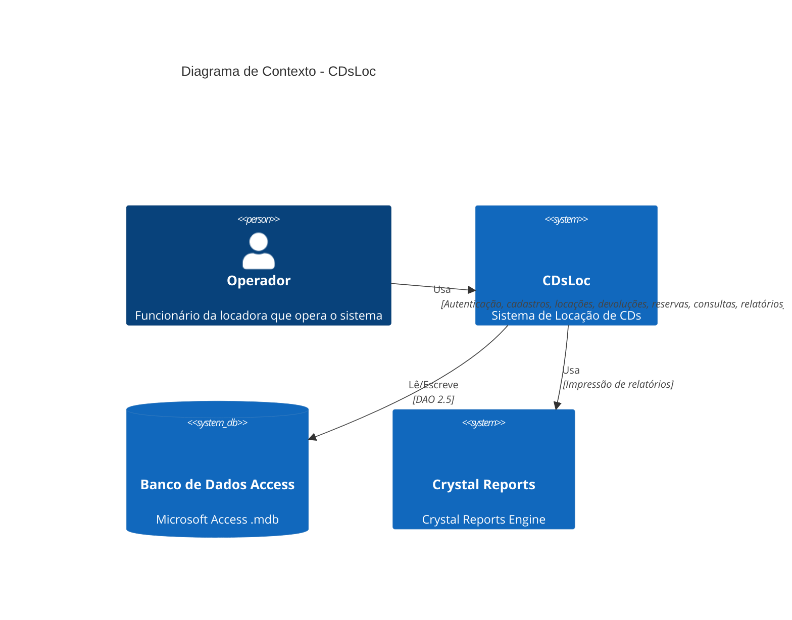

# C4 Context — CDsLoc

> Gerado pelo Reversa em 2026-05-08
> Diagrama de contexto do sistema de locação de CDs (Nível 1)

---

## Descrição do Contexto

O sistema **CDsLoc** é uma aplicação desktop monousuário para gestão de locação de CDs de música. Ele opera em uma estação local com acesso direto a um banco de dados Access.

---

## Diagrama C4 Contexto

---

## Atores do Sistema

### Operador (user)

**Descrição:** Funcionário da locadora que opera o sistema diariamente.

**Responsabilidades:**
- Autenticar-se no sistema
- Cadastrar clientes e dependentes
- Gerenciar catálogo de CDs (títulos, músicas, exemplares)
- Realizar locações e devoluções
- Gerenciar reservas de CDs
- Consultar informações do sistema
- Imprimir relatórios

**Características:**
- Usa senha única compartilhada (sem login individual)
- Tem acesso total a todas as funcionalidades após login
- Opera em estação local

---

## Sistemas Externos

### Banco de Dados Access

**Descrição:** Arquivo Microsoft Access (.mdb) que armazena todos os dados do sistema.

**Tecnologia:** Microsoft Access via DAO 2.5

**Função:**
- Persistência de dados
- Consultas SQL
- Integridade referencial

**Comunicação:**
- Acesso direto via DAO (Data Access Objects)
- Local no mesmo computador da aplicação
- Transações não explícitas

### Crystal Reports Engine

**Descrição:** Motor de geração de relatórios Crystal Reports.

**Tecnologia:** Crystal Reports 4.6/5.2

**Função:**
- Geração de 12 relatórios pré-formatados
- Impressão de recibos, listagens e análises

**Comunicação:**
- Via controle OCX CRYSTL32.OCX
- Arquivos .rpt independentes do código VB6

---

## Relacionamentos

| Relacionamento | Tipo | Descrição | Protocolo |
|----------------|------|-----------|-----------|
| Operador → CDsLoc | Usa | Operador interage com todas as funcionalidades | Interface gráfica VB6 (Mouse/Teclado) |
| CDsLoc → Access | Lê/Escreve | Sistema acessa dados diretamente | DAO 2.5 (ODBC Jet Engine) |
| CDsLoc → Crystal Reports | Usa | Sistema gera relatórios | Crystal Reports API (via OCX) |

---

## Sumário de Comunicação

| De | Para | Propósito | Frequência | Volume |
|----|------|-----------|------------|--------|
| Operador | CDsLoc | Operações diárias (cadastros, locações, devoluções) | Contínuo | Médio |
| CDsLoc | Access | Persistência de dados | Contínuo | Alto |
| CDsLoc | Crystal Reports | Geração de relatórios | Periódico | Variável |

---

## Observações

🔴 **Lacunas Identificadas:**

1. **Sem Servidor:** O sistema é puramente desktop, não há servidor de aplicação
2. **Sem API:** Não há interface REST ou SOAP para integração externa
3. **Autenticação Simplificada:** Senha única global, sem identificação individual de usuários
4. **Sem Backup Automatizado:** Backup do banco deve ser feito manualmente

🟢 **Pontos Fortes:**

1. **Simplicidade:** Arquitetura simples, fácil de entender
2. **Independência:** Não depende de rede ou serviços externos
3. **Performance:** Acesso direto ao banco, sem overhead de rede
