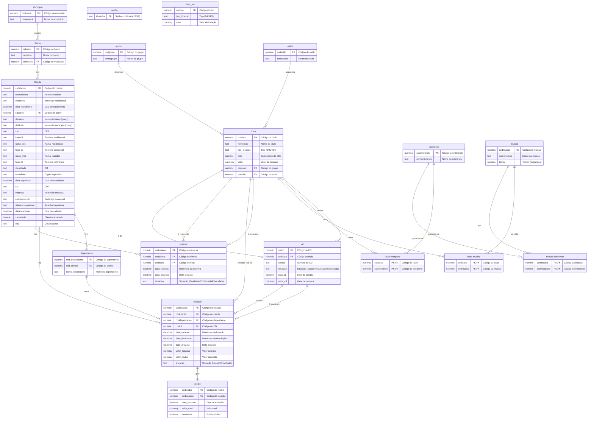

# ERD Completo — CDsLoc

> Gerado pelo Reversa em 2026-05-08
> Diagrama Entidade-Relacionamento completo do sistema de locação de CDs

---

## Descrição do Modelo de Dados

O sistema CDsLoc utiliza um banco de dados Microsoft Access com 18 tabelas organizadas em domínios funcionais:
- Cadastro de clientes e dependentes
- Catálogo de CDs (títulos, músicas, intérpretes)
- Gestão de locações e recibos
- Gestão de reservas
- Tabelas auxiliares e sistema

---

## Diagrama ERD Completo

---

## Tabelas por Domínio

### Domínio: Cadastro de Clientes

| Tabela | Descrição | Registros Estimados | Confiança |
|--------|-----------|---------------------|-----------|
| `Cliente` | Dados completos de clientes | 🟡 INFERIDO | 🟢 CONFIRMADO |
| `dependente` | Dependentes autorizados | 🟡 INFERIDO | 🟢 CONFIRMADO |
| `Bairro` | Lista de bairros disponíveis | 🟡 INFERIDO | 🟢 CONFIRMADO |
| `Municipio` | Lista de municípios | 🟡 INFERIDO | 🟢 CONFIRMADO |

### Domínio: Catálogo de CDs

| Tabela | Descrição | Registros Estimados | Confiança |
|--------|-----------|---------------------|-----------|
| `titulo` | Títulos de CDs (álbuns) | 🟡 INFERIDO | 🟢 CONFIRMADO |
| `cd` | Exemplares físicos de CDs | 🟡 INFERIDO | 🟢 CONFIRMADO |
| `musica` | Músicas individuais | 🟡 INFERIDO | 🟢 CONFIRMADO |
| `interprete` | Intérpretes musicais | 🟡 INFERIDO | 🟢 CONFIRMADO |
| `titulo-interprete` | Relação título ↔ intérprete | 🟡 INFERIDO | 🟢 CONFIRMADO |
| `titulo-musica` | Relação título ↔ música | 🟡 INFERIDO | 🟢 CONFIRMADO |
| `musica-interprete` | Relação música ↔ intérprete | 🟡 INFERIDO | 🟢 CONFIRMADO |
| `grupo` | Grupos de classificação | 🟡 INFERIDO | 🟢 CONFIRMADO |
| `estilo` | Estilos musicais | 🟡 INFERIDO | 🟢 CONFIRMADO |

### Domínio: Movimentação

| Tabela | Descrição | Registros Estimados | Confiança |
|--------|-----------|---------------------|-----------|
| `locacao` | Registro de locações | 🟡 INFERIDO | 🟢 CONFIRMADO |
| `recibo` | Recibos emitidos | 🟡 INFERIDO | 🟢 CONFIRMADO |

### Domínio: Reservas

| Tabela | Descrição | Registros Estimados | Confiança |
|--------|-----------|---------------------|-----------|
| `reserva` | Registro de reservas | 🟡 INFERIDO | 🟢 CONFIRMADO |

### Domínio: Sistema

| Tabela | Descrição | Registros Estimados | Confiança |
|--------|-----------|---------------------|-----------|
| `senha` | Senha de acesso ao sistema | 1 registro | 🟢 CONFIRMADO |
| `valor_loc` | Tabela de valores de locação | 2 registros (24h/48h) | 🟡 INFERIDO |

---

## Relacionamentos Detalhados

### Cliente ↔ Dependente

| Propriedade | Valor |
|-------------|-------|
| Tipo | 1:N |
| Descrição | Um cliente pode ter múltiplos dependentes |
| Chave Estrangeira | `dependente.cod_cliente → Cliente.codcliente` |
| Regra de Negócio | Cliente cancelado não pode cadastrar dependentes |

### Cliente ↔ Bairro

| Propriedade | Valor |
|-------------|-------|
| Tipo | N:1 |
| Descrição | Múltiplos clientes podem estar no mesmo bairro |
| Chave Estrangeira | `Cliente.cdbairro → Bairro.cdbairro` |
| Regra de Negócio | Bairro deve ser selecionado de lista pré-cadastrada |

### Bairro ↔ Município

| Propriedade | Valor |
|-------------|-------|
| Tipo | N:1 |
| Descrição | Múltiplos bairros pertencem a um município |
| Chave Estrangeira | `Bairro.codmunic → Municipio.codmunic` |

### Título ↔ CD

| Propriedade | Valor |
|-------------|-------|
| Tipo | 1:N |
| Descrição | Um título pode ter múltiplos CDs físicos |
| Chave Estrangeira | `cd.codtitulo → titulo.codtitulo` |
| Regra de Negócio | `titulo.qtde` define quantidade de CDs |

### Título ↔ Interprete (M:N)

| Propriedade | Valor |
|-------------|-------|
| Tipo | N:M |
| Tabela Associativa | `titulo-interprete` |
| Chaves Compostas | `codtitulo`, `codinterprete` |

### Título ↔ Música (M:N)

| Propriedade | Valor |
|-------------|-------|
| Tipo | N:M |
| Tabela Associativa | `titulo-musica` |
| Chaves Compostas | `codtitulo`, `codmusica` |

### Música ↔ Interprete (M:N)

| Propriedade | Valor |
|-------------|-------|
| Tipo | N:M |
| Tabela Associativa | `musica-interprete` |
| Chaves Compostas | `codmusica`, `codinterprete` |

### Locação ↔ Cliente

| Propriedade | Valor |
|-------------|-------|
| Tipo | N:1 |
| Descrição | Múltiplas locações podem ser do mesmo cliente |
| Chave Estrangeira | `locacao.codcliente → Cliente.codcliente` |
| Regra de Negócio | Cliente cancelado não pode fazer locações |

### Locação ↔ Dependente

| Propriedade | Valor |
|-------------|-------|
| Tipo | N:1 (opcional) |
| Descrição | Locação pode ser feita por dependente |
| Chave Estrangeira | `locacao.coddependente → dependente.cod_dependente` |
| Regra de Negócio | Dependente vinculado a cliente titular |

### Locação ↔ CD

| Propriedade | Valor |
|-------------|-------|
| Tipo | N:1 |
| Descrição | Um CD pode ter múltiplas locações ao longo do tempo |
| Chave Estrangeira | `locacao.codcd → cd.codcd` |
| Regra de Negócio | CD locado não pode ser locado novamente |

### Locação ↔ Recibo

| Propriedade | Valor |
|-------------|-------|
| Tipo | 1:1 |
| Descrição | Cada locação gera um recibo |
| Chave Estrangeira | `recibo.codlocacao → locacao.codlocacao` |
| Regra de Negócio | Recibo só pode ser baixado uma vez |

### Reserva ↔ Cliente

| Propriedade | Valor |
|-------------|-------|
| Tipo | N:1 |
| Descrição | Múltiplas reservas podem ser do mesmo cliente |
| Chave Estrangeira | `reserva.codcliente → Cliente.codcliente` |

### Reserva ↔ Título

| Propriedade | Valor |
|-------------|-------|
| Tipo | N:1 |
| Descrição | Múltiplas reservas podem ser do mesmo título |
| Chave Estrangeira | `reserva.codtitulo → titulo.codtitulo` |
| Regra de Negócio | Reserva é por título, não por CD físico |

---

## Índices

| Tabela | Índice | Tipo | Confiança |
|--------|--------|------|-----------|
| Cliente | primarykey | Unique (codcliente) | 🟢 CONFIRMADO |
| Cliente | nomecliente | Non-Unique | 🟢 CONFIRMADO |
| dependente | nome_dependente | Non-Unique | 🟢 CONFIRMADO |
| dependente | cod_cliente, cod_dependente | Composite | 🟡 INFERIDO |
| Bairro | primarykey | Unique (cdbairro) | 🟡 INFERIDO |
| titulo | primarykey | Unique (codtitulo) | 🟡 INFERIDO |
| cd | primarykey | Unique (codcd) | 🟡 INFERIDO |
| cd | codtitulo | Non-Unique | 🟡 INFERIDO |
| locacao | primarykey | Unique (codlocacao) | 🟡 INFERIDO |
| recibo | primarykey | Unique (codrecibo) | 🟡 INFERIDO |
| reserva | primarykey | Unique (codreserva) | 🟡 INFERIDO |

---

## Lacunas no Modelo (🔴)

| Lacuna | Descrição | Impacto |
|--------|-----------|---------|
| **Campo `qtde_disp` em `titulo`** | Referenciado no código mas não existe na tabela | 🔴 Controle de estoque pode estar incompleto |
| **Estado "Reservado" em `cd`** | Situação "Reservado" não encontrada nas consultas | 🔴 Pode haver estado não implementado |
| **Cálculo de multa em `locacao`** | Campo `valor_multa` existe mas código de cálculo não foi encontrado | 🔴 Sistema pode não cobrar multas |
| **Uso de `valor_loc`** | Tabela existe mas uso no código não está claro | 🔴 Pode haver tabela de preços não implementada |
| **Índices não documentados** | Muitos índices inferidos, não confirmados | 🔴 Performance pode ser afetada |

---

## Notas sobre o Modelo

### Padrões de Nomenclatura

- **Tabelas:** Nome em minúsculas (ex: `Cliente`, `dependente`, `Bairro`)
- **Campos de código:** prefixo `cod` ou `cd` (ex: `codcliente`, `codtitulo`)
- **Campos de descrição:** prefixo `nome` ou `de` (ex: `nomecliente`, `debairro`)
- **Campos compostos:** hífen no meio (ex: `data-nascimento`, `fone-01`)
- **Chaves primárias:** geralmente `cod[entidade]`
- **Chaves estrangeiras:** mesmo nome da PK da tabela referenciada

### Integridade Referencial

- O sistema usa integridade referencial do Access
- Erro 3200 indica violação de integridade
- Exclusão de cliente com dependentes é bloqueada
- Exclusão de título com locações é bloqueada

### Sem Transações Explícitas

- O sistema não usa transações explícitas
- Atualizações são diretas via DAO
- Risco de inconsistência em caso de erro parcial
