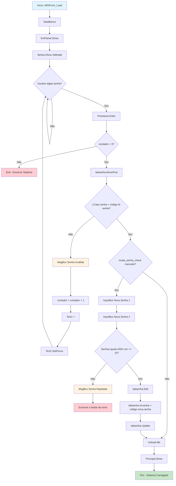
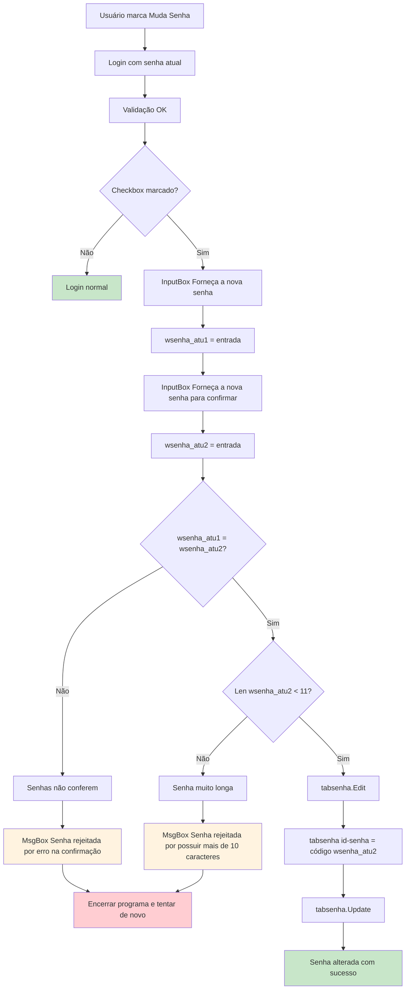
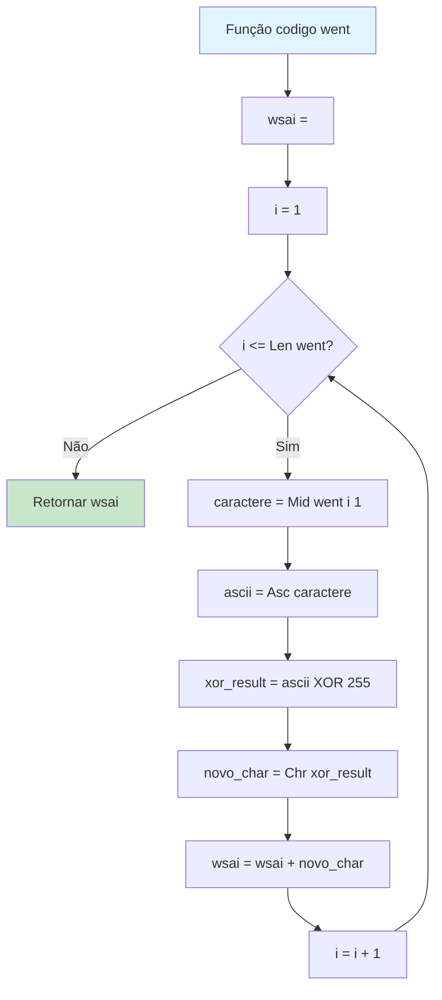

# Fluxograma: Autenticação

> Módulo: autenticacao (SENHA.FRM)
> Gerado pelo Reversa em 2026-05-08

## Fluxo Principal de Login

## Fluxo de Alteração de Senha

## Algoritmo de Codificação (XOR)

## Descrição dos Passos

### Login Principal

1. **Inicialização:** O MDIForm_Load conecta ao banco, mostra splash screen e exibe o form de senha como modal
2. **Entrada da Senha:** Usuário digita senha no campo Text1 (máscara `*`)
3. **Validação:** Sistema compara a senha digitada com a senha armazenada usando a função `codigo()`
4. **Contador de Tentativas:** Cada erro incrementa o contador
5. **Limite:** Após 3 tentativas, o sistema encerra
6. **Alteração de Senha:** Se checkbox marcado, permite alteração

### Alteração de Senha

1. **Confirmação:** Usuário deve digitar a senha duas vezes
2. **Validação de Igualdade:** As duas senhas devem ser idênticas
3. **Validação de Tamanho:** Máximo de 10 caracteres
4. **Gravação:** Nova senha é codificada e salva na tabela `senha`

### Função de Codificação

A função `codigo()` aplica XOR bit-a-bit com 255 em cada caractere:
- XOR 255 é equivalente a NOT bit-a-bit (inversão de bits)
- Esta operação é reversível: `codigo(codigo(x)) = x`
- **Nota:** Esta é uma criptografia muito fraca, reversível e não segura por padrões modernos

## Variáveis Locais

| Variável | Tipo | Descrição |
|----------|------|-----------|
| contador | Integer | Contador de tentativas de login |
| went | String | Parâmetro de entrada para função codigo() |
| wsai | String | String resultante da codificação |
| wsenha_atu1 | String | Primeira entrada da nova senha |
| wsenha_atu2 | String | Segunda entrada (confirmação) da nova senha |
