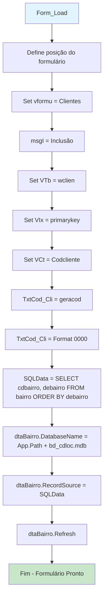
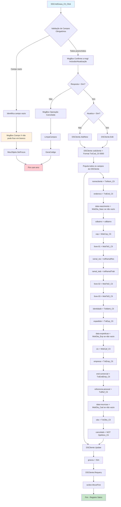
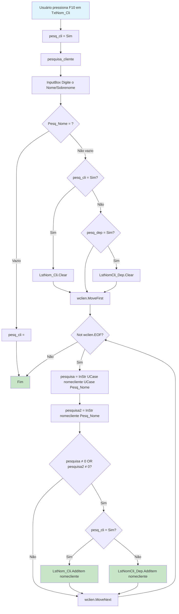
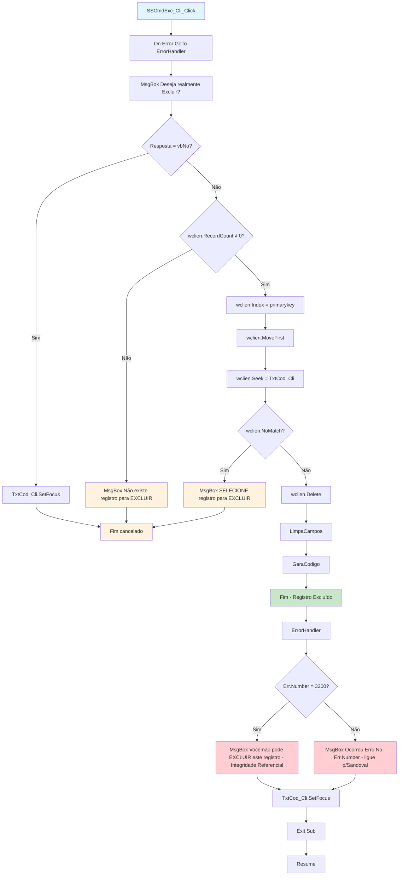
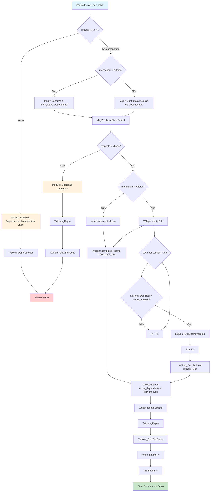
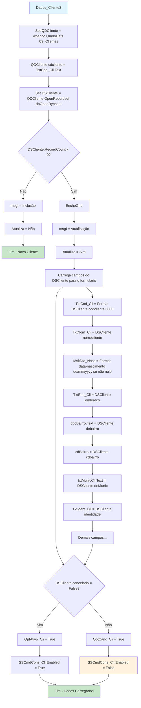

# Fluxograma: Cadastro de Clientes

> Módulo: clientes (cliente.frm)
> Gerado pelo Reversa em 2026-05-08

## Fluxo Principal de Inicialização

## Fluxo de Gravação de Cliente

## Fluxo de Pesquisa de Cliente

## Fluxo de Exclusão de Cliente

## Fluxo de Gravação de Dependente

## Fluxo de Carregamento de Dados do Cliente (Dados_Cliente2)

## Descrição dos Passos

### Validação de Campos

Antes de gravar, o sistema verifica:
1. Código do cliente não vazio
2. Nome do cliente não vazio
3. Endereço não vazio
4. Data de nascimento não vazia
5. Bairro selecionado (cdBairro ≠ 0)
6. Identidade não vazia

### Pesquisa Flexível

A pesquisa de clientes usa `InStr()` duas vezes:
- Uma com `UCase()` para buscar maiúsculas
- Uma sem conversão para buscar minúsculas
- Isso torna a busca case-insensitive

### Tratamento de Erro na Exclusão

O erro 3200 indica violação de integridade referencial, ou seja:
- O cliente possui dependentes cadastrados
- O cliente possui locações ativas
- O cliente possui reservas

### Geração de Código

O código é gerado pela função `geracod()` que:
1. Move para o último registro
2. Lê o valor atual do campo especificado
3. Retorna valor + 1
4. Retorna 1 se tabela vazia

## Variáveis Locais

| Variável | Tipo | Descrição |
|----------|------|-----------|
| pesq_dep | String | Flag indicando pesquisa para dependente |
| pesq_cli | String | Flag indicando pesquisa para cliente |
| mensagem | String | "Incluir" ou "Alterar" |
| nome_anterior | String | Nome anterior do dependente (para alteração) |
| cdBairro | Integer | Código do bairro selecionado |
| cod_dependente | String | Código do dependente selecionado |
