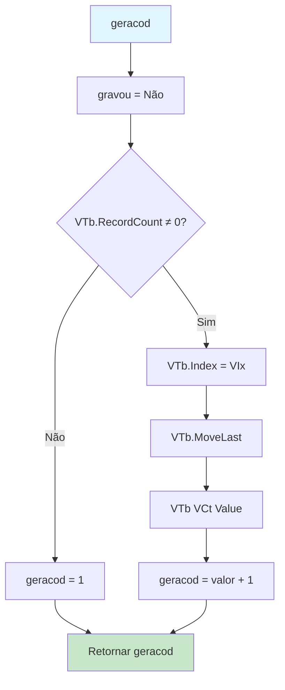
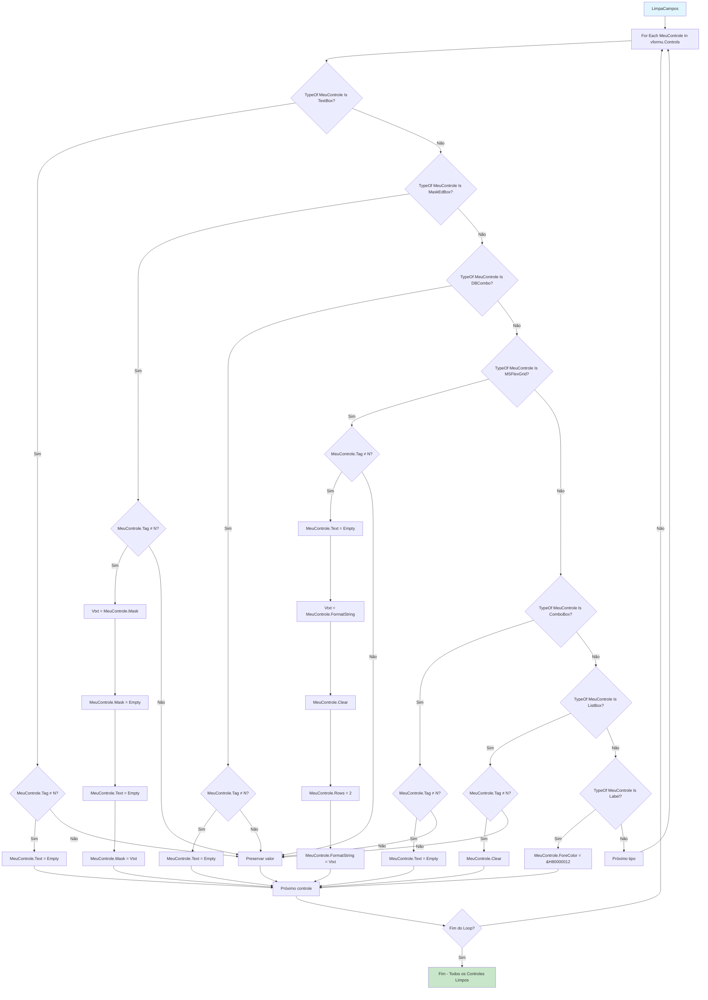
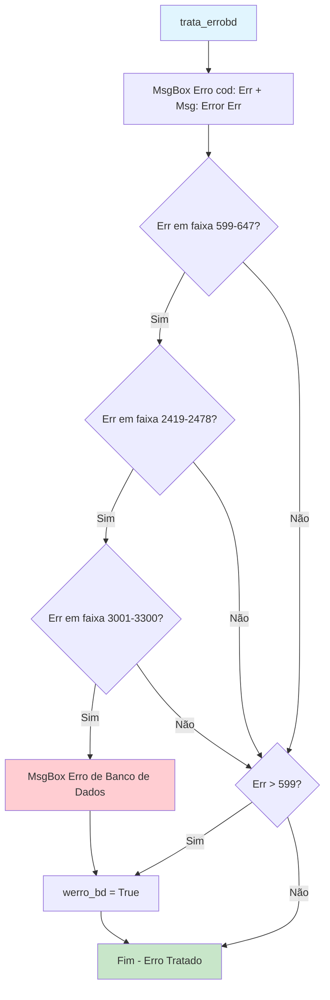

# Fluxograma: Módulo Global (DECLARA.BAS)

> Módulo: modulo-global (DECLARA.BAS)
> Gerado pelo Reversa em 2026-05-08

## Fluxo: SetaBanco - Inicialização do Banco de Dados

```mermaid
flowchart TD
    A[SetaBanco] --> B[ChDrive Left App.Path 2]
    B --> C[ChDir App.Path]
    C --> D[Set wbanco = Workspaces 0 OpenDatabase App.Path + bd_cdloc.mdb]
    D --> E[Set Winterprete = wbanco.OpenRecordset interprete]
    E --> F[Set Wgrupo = wbanco.OpenRecordset grupo]
    F --> G[Set Westilo = wbanco.OpenRecordset estilo]
    G --> H[Set wMunic = wbanco.OpenRecordset Municipio]
    H --> I[Set wBairro = wbanco.OpenRecordset Bairro]
    I --> J[Set wclien = wbanco.OpenRecordset Cliente]
    J --> K[Set Wdependente = wbanco.OpenRecordset dependente]
    K --> L[Set Wcdfisico = wbanco.OpenRecordset cd]
    L --> M[Set wtinterprete = wbanco.OpenRecordset titulo-interprete]
    M --> N[Set wmusica = wbanco.OpenRecordset musica]
    N --> O[Set Wminterprete = wbanco.OpenRecordset musica-interprete]
    O --> P[Set Wtitulo = wbanco.OpenRecordset titulo]
    P --> Q[Set Wtmusica = wbanco.OpenRecordset titulo-musica]
    Q --> R[Set Wlocacao = wbanco.OpenRecordset locacao]
    R --> S[Set Wrecibo = wbanco.OpenRecordset recibo]
    S --> T[Set wvalor_loc = wbanco.OpenRecordset valor_loc]
    T --> U[Set Wreserva = wbanco.OpenRecordset reserva]
    U --> V[Set tabsenha = wbanco.OpenTable senha]
    V --> W[Fim - Todos os Recordsets Inicializados]

    style A fill:#e1f5fe
    style W fill:#c8e6c9
```



## Fluxo: geracod - Geração de Código Sequencial



## Fluxo: LimpaCampos - Limpeza de Controles



## Fluxo: trata_errobd - Tratamento de Erro



## Descrição dos Passos

### SetaBanco

Esta função é chamada uma única vez durante a inicialização do sistema:
1. Muda o diretório atual para o diretório da aplicação
2. Abre o banco de dados Access `bd_cdloc.mdb`
3. Abre todas as tabelas como Recordsets globais
4. Os Recordsets ficam disponíveis para todos os formulários

### geracod

Função estática que gera o próximo código sequencial:
1. Verifica se a tabela tem registros
2. Se vazia, retorna 1
3. Se não vazia, indexa pelo índice especificado
4. Move para o último registro
5. Retorna valor do campo especificado + 1

**Uso típico:**
```vb
Set VTb = wclien
VIx = "primarykey"
VCt = "Codcliente"
TxtCod_Cli = geracod()
```

### LimpaCampos

Função genérica que limpa todos os controles de um formulário:
1. Itera por todos os controles do formulário (vformu)
2. Verifica o tipo de cada controle
3. Limpa conforme o tipo, respeitando a propriedade `Tag`
4. Se `Tag = "N"`, o controle não é limpo

**Tipos suportados:**
- TextBox → Text = Empty
- MaskEdBox → Preserva máscara, limpa texto
- DBCombo → Text = Empty
- MSFlexGrid → Limpa e redefine para 2 linhas
- ComboBox → Text = Empty
- ListBox → Clear
- Label → Restaura cor de texto padrão

### trata_errobd

Trata erros de banco de dados:
1. Exibe mensagem de erro com código e descrição
2. Verifica se erro está em faixas específicas de erros de DAO/Access
3. Se for erro de banco, exibe mensagem adicional
4. Define `werro_bd = True` para indicar que transação deve ser cancelada

**Faixas de erro:**
- 599-647: Erros de DAO
- 2419-2478: Erros de banco de dados Jet
- 3001-3300: Outros erros de banco

## Variáveis Globais

| Variável | Tipo | Descrição |
|----------|------|-----------|
| wbanco | Database | Conexão principal com o banco |
| wclien | Recordset | Tabela Cliente |
| Wdependente | Recordset | Tabela Dependente |
| Wcdfisico | Recordset | Tabela CD |
| Westilo | Recordset | Tabela Estilo |
| wMunic | Recordset | Tabela Município |
| wBairro | Recordset | Tabela Bairro |
| Wgrupo | Recordset | Tabela Grupo |
| Winterprete | Recordset | Tabela Intérprete |
| wtinterprete | Recordset | Tabela Título-Intérprete |
| Wlocacao | Recordset | Tabela Locação |
| wmusica | Recordset | Tabela Música |
| Wminterprete | Recordset | Tabela Música-Intérprete |
| Wrecibo | Recordset | Tabela Recibo |
| Wreserva | Recordset | Tabela Reserva |
| Wtitulo | Recordset | Tabela Título |
| Wtmusica | Recordset | Tabela Título-Música |
| tabsenha | Recordset | Tabela Senha |
| wvalor_loc | Recordset | Tabela Valor de Locação |
| vformu | Form | Formulário atual para limpeza |
| Atualiza | String | "Sim" ou "Não" - indica edição/inclusão |
| gravou | String | "Sim" ou "Não" - indica gravação |
| msgI | String | "Inclusão" ou "Atualização" |
| VTb | Recordset | Tabela para geracod() |
| VIx | String | Nome do índice para geracod() |
| VCt | String | Nome do campo para geracod() |
| werro_bd | Integer | Flag de erro de banco |
