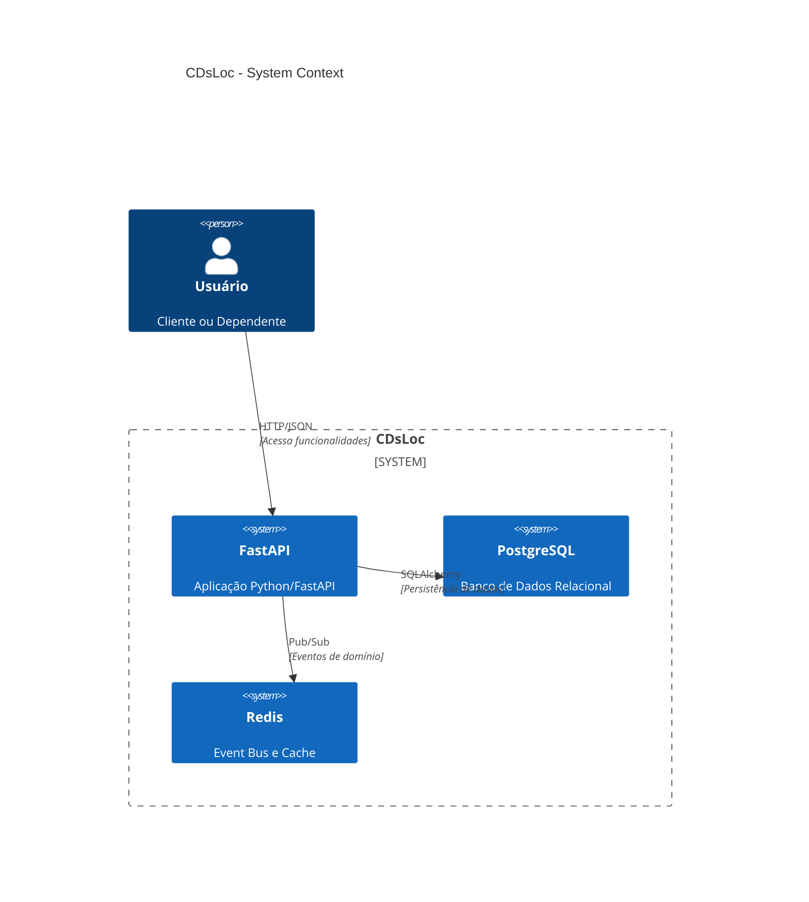
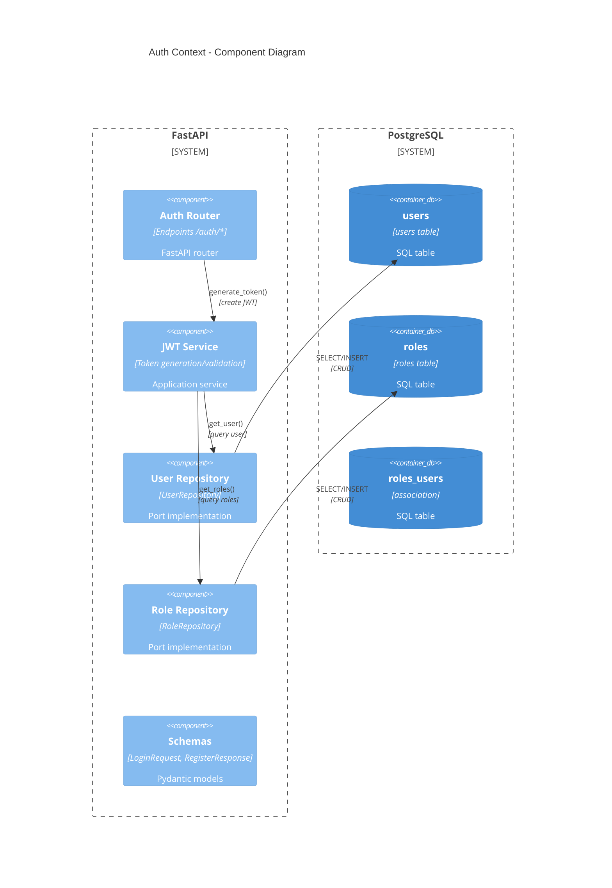

# Target Architecture — CDsLoc

> Arquitetura alvo do sistema novo: hexagonal com bounded contexts, separação de domínio, event-driven.
> Decisão de topologia registrada em `topology_decision.md` (Opção 2: Modernizar).

---

## Visão Geral

```
┌─────────────────────────────────────────────────────────────────┐
│                     Browser / Mobile Client                   │
│                    (Vue.js / React)                        │
└─────────────────────────────────────────────────────────────────┘
                              │
                              │ HTTP/JSON
                              ▼
┌─────────────────────────────────────────────────────────────────┐
│                      API Gateway / Nginx                       │
│                  (Auth, Rate Limiting, CORS)                │
└─────────────────────────────────────────────────────────────────┘
                              │
                              │ HTTP/JSON
                              ▼
┌─────────────────────────────────────────────────────────────────┐
│                      FastAPI Application                      │
│                 (Python 3.11+, async/await)                 │
├─────────────────────────────────────────────────────────────────┤
│  Adapters Layer (ports implementations)                    │
│  ├─ HTTP Adapters (routers, schemas, middleware)       │
│  ├─ DB Adapters (SQLAlchemy repositories)               │
│  ├─ Report Adapters (HTML/PDF templates)              │
│  └─ Messaging Adapters (Redis pub/sub)                  │
├─────────────────────────────────────────────────────────────────┤
│  Bounded Contexts (domain + services + ports)             │
│  ├─ Auth Context (JWT, User, Role)                      │
│  ├─ Catalog Context (Title, Music, Cd, Interpreter)        │
│  ├─ Customers Context (Customer, Dependent, Address)        │
│  ├─ Rentals Context (Rental, Receipt, Item, Calculation)    │
│  ├─ Reservations Context (Reservation, Conversion)          │
│  └─ Reports Context (ReportSpec, Templates)                │
├─────────────────────────────────────────────────────────────────┤
│  Shared Domain (events, value objects, aggregates)           │
│  ├─ Domain Events (RentalCreated, ReturnedLate, etc.)      │
│  ├─ Value Objects (Money, CEP, CPF, DateRange)            │
│  └─ Infrastructure (event bus, logging, config)             │
└─────────────────────────────────────────────────────────────────┘
                              │
                              │ Async SQLAlchemy
                              ▼
┌─────────────────────────────────────────────────────────────────┐
│                    PostgreSQL 14+                              │
│                 (Bounded Contexts Schema)                    │
└─────────────────────────────────────────────────────────────────┘
                              │
                              │ Redis Streams
                              ▼
┌─────────────────────────────────────────────────────────────────┐
│                      Event Bus (Redis)                         │
│            (domain events → projections/adapters)             │
└─────────────────────────────────────────────────────────────────┘
```

---

## Diagramas Mermaid

### C4 Context



### C4 Containers

```mermaid
C4Container
    title CDsLoc - Container Diagram
    Person(user, "Usuário", "Cliente ou Dependente")
    
    Container_Boundary(app, "FastAPI", "Aplicação Web", "Python") {
        Container(api, "API Layer", "FastAPI + Pydantic", "Routers e Schemas REST")
        Container(bounded_contexts, "Bounded Contexts", "Domain + Services", "Auth, Catalog, Customers, Rentals, Reservations, Reports")
        Container(shared, "Shared Domain", "Events e Value Objects", "Domain Events, Money, CEP, CPF, etc.")
        Container(adapters, "Adapters Layer", "Ports Implementations", "HTTP, DB, Report, Messaging")
    }
    
    ContainerDb(postgres, "PostgreSQL", "Banco de Dados", "PostgreSQL 14+") {
        ContainerDb(auth_schema, "Auth Schema", "Users, Roles, Tokens")
        ContainerDb(catalog_schema, "Catalog Schema", "Titles, Musics, CDs, Interpreters")
        ContainerDb(customers_schema, "Customers Schema", "Customers, Dependents, Addresses")
        ContainerDb(rentals_schema, "Rentals Schema", "Rentals, Receipts, Items")
        ContainerDb(reservations_schema, "Reservations Schema", "Reservations, Conversions")
    }
    
    ContainerDb(redis, "Redis", "Event Bus e Cache", "Redis 7+")
    
    Rel(user, api, "HTTP/JSON", "Requests e Responses")
    BiRel(adapters, postgres, "SQLAlchemy", "Repositories")
    BiRel(adapters, redis, "Redis Pub/Sub", "Publish/Subscribe")
    Rel(bounded_contexts, shared, "Python", "Import Domain Events")
    Rel(bounded_contexts, adapters, "Depends()", "Use Ports")
    Rel(adapters, redis, "Publish Events", "Domain Events")
```

### Component Diagram (Auth Context)



### Component Diagram (Rentals Context)

```mermaid
C4Component
    title Rentals Context - Component Diagram
    
    System_Boundary(app, "FastAPI", "Rentals Context") {
        Component(api_router, "Rentals Router", "Endpoints /rentals/*", "FastAPI router")
        Component(rental_service, "Rental Service", "CreateRental, ReturnRental", "Application service")
        Component(receipt_service, "Receipt Service", "GenerateReceipt, AddItem", "Application service")
        Component(calc_service, "Calculation Service", "CalculateMulta, CalculateDataPrevista", "Domain service")
        Component(rental_repo, "Rental Repository", "RentalRepository", "Port implementation")
        Component(receipt_repo, "Receipt Repository", "ReceiptRepository", "Port implementation")
        Component(cd_repo, "CD Repository", "CDRepository", "Port implementation")
        Component(title_repo, "Title Repository", "TitleRepository", "Port implementation")
        Component(pydantic_schemas, "Schemas", "RentalRequest, ReturnRequest, ReceiptResponse", "Pydantic models")
    }
    
    System_Boundary(db, "PostgreSQL", "Rentals Schema") {
        ContainerDb(rentals_table, "rentals", "rentals table", "SQL table")
        ContainerDb(receipts_table, "receipts", "receipts table", "SQL table")
        ContainerDb(items_table, "rental_items", "rental_items table", "SQL table")
    }
    
    System_Boundary(catalog, "Catalog Context", "PostgreSQL", "Catalog Schema") {
        ContainerDb(cds_table, "cds", "cds table", "SQL table")
        ContainerDb(titles_table, "titles", "titles table", "SQL table")
    }
    
    Rel(api_router, rental_service, "create_rental()", "handle rental")
    Rel(rental_service, calc_service, "calculate_multa()", "get penalty amount")
    Rel(rental_service, receipt_service, "generate_receipt()", "create receipt")
    Rel(rental_service, rental_repo, "save()", "persist rental")
    Rel(rental_service, cd_repo, "update_status()", "mark as rented")
    Rel(rental_service, title_repo, "get_title()", "query title info")
    Rel(rental_repo, rentals_table, "INSERT", "create rental")
    Rel(receipt_repo, receipts_table, "INSERT", "create receipt")
    Rel(receipt_repo, items_table, "INSERT", "create items")
    Rel(rental_service, catalog, "SELECT", "query from catalog context")
    Rel(calc_service, db, "SELECT", "query from rentals")
```

---

## Bounded Contexts

| Bounded Context | Responsabilidade | Agregados Raiz | Eventos de Domínio Publicados |
|----------------|-----------------|------------------|------------------------------|
| **Auth** | Autenticação, autorização, gestão de usuários/roles | User, Role | UserCreated, UserActivated, RoleAssigned |
| **Catalog** | Títulos, músicas, intérpretes, CDs físicos, estoque | Title, Musica, Interprete, CdFisico | TitleCreated, CdRegistered, StockUpdated, CdStatusChanged |
| **Customers** | Clientes, dependentes, endereços, bairros | Cliente, Dependente | ClienteCreated, ClienteActivated, ClienteCancelled, DependenteAdded |
| **Rentals** | Locações, recibos, cálculo de multa, prazos | Locacao, Recibo, ItemLocacao | LocacaoCriada, DevolucaoRegistrada, MultaCalculada |
| **Reservations** | Reservas, conversão em locação | Reserva | ReservaCriada, ReservaConfirmada, ReservaCancelada, ReservaConvertida |
| **Reports** | Relatórios HTML/PDF, templates | ReportSpecification | ReportRequested |

---

## Decisões Arquiteturais

### Separação de Camadas

| Camada | Tecnologia | Responsabilidade |
|---------|-----------|------------------|
| **API Layer** | FastAPI + Pydantic | Endpoints REST, validação de entrada, conversão de DTOs |
| **Application Layer** | Services (async) | Casos de uso, orquestração de agregados, publicação de eventos |
| **Domain Layer** | Pure Python (sem external deps) | Entidades, value objects, regras de negócio, interfaces de ports |
| **Adapters Layer** | SQLAlchemy, Jinja2, Redis | Implementações de ports, acesso a infraestrutura |
| **Infrastructure Layer** | Logging, Config, Event Bus | Cross-cutting concerns |

**Justificativa:** Separação clara respeita o paradigma OO com DI e event-driven. Domain layer permanece puro, facilitando testes.

### Async Throughout

| Componente | Assinatura | Justificativa |
|-------------|-------------|---------------|
| Todos os serviços | `async def` | Paradigma alvo exige async/await em toda operação de banco |
| Repositories | `async def CRUD` | Acesso a banco via async session do SQLAlchemy |
| Endpoints | `async def` | FastAPI nativamente async |

**Justificativa:** Honra a decisão de paradigma (`paradigm_decision.md` § "Acesso direto ao banco vira repositório assíncrono").

### Injeção de Dependências (Dependency Injection)

| Mecanismo | Tecnologia | Justificativa |
|------------|-----------|---------------|
| Port Interfaces | ABC (abstract base class) | Domain define interfaces, Adapters implementam |
| FastAPI Depends | `Depends()` | Injeção em endpoints e serviços |
| Type Hints | Python 3.11+ | Autocomplete e mypy validação |

**Justificativa:** Honra a decisão de paradigma (`paradigm_decision.md` § "Funções globais vira injeção de dependências").

### Event-Driven

| Aspecto | Tecnologia | Justificativa |
|---------|-----------|---------------|
| Domain Events | Dataclasses / Pydantic | Modelos imutáveis para eventos |
| Event Bus | Redis Streams | Pub/Sub desacoplado, escalável |
| Projections | (futuro) | Leitura otimizada de eventos (se necessário) |

**Justificativa:** Event-driven permite desacoplamento entre bounded contexts. Rentals pode publicar `DevolucaoRegistrada` e Reports ouvir para gerar relatórios diários.

### Hexagonal Architecture

| Hexagon Layer | Exemplos |
|---------------|-----------|
| **Domain (Core)** | Locacao, Recibo, Money, DataPrevista, regras de negócio |
| **Ports** (Interfaces) | RentalRepository, RentalService, CalculationService |
| **Adapters (Secondary)** | PostgreSQLRentalRepository, CalculationService (domain), HTMLReportAdapter |

**Justificativa:** Permite testar domain com mocks de ports facilmente. Adapters podem ser substituídos (ex: PostgreSQL → MySQL) sem mudar domain.

---

## Tecnologias por Camada

| Camada | Tecnologia | Versão |
|---------|-----------|--------|
| **Frontend** | (Fora de escopo, sugerido: Vue.js 3 ou React 18) | - |
| **API Gateway** | Nginx | 1.24+ |
| **API Framework** | FastAPI | 0.104+ |
| **Validation** | Pydantic | 2.5+ |
| **ORM** | SQLAlchemy | 2.0+ (async) |
| **Database** | PostgreSQL | 14+ |
| **Event Bus** | Redis | 7+ (streams) |
| **Reporting** | Jinja2 + WeasyPrint | 3.1+ / 60+ |
| **Container** | Docker | 20.10+ |
| **Orchestration** | Docker Compose | 2.20+ |
| **Testing** | pytest + pytest-asyncio | - |

---

## Honra ao Paradigma Escolhido

### OO com DI + Event-driven (do `paradigm_decision.md`)

| Decisão | Como é Materializada |
|----------|----------------------|
| **Acesso direto ao banco vira repositório assíncrono** | Todos os repositories usam `async def` com SQLAlchemy AsyncSession |
| **Validação de campos vira Pydantic schemas** | Endpoints validam via Pydantic; domain valida invariantes |
| **Tratamento de erro vira exceções estruturadas + HTTP status codes** | Global exception handler converte `Exception` em `HTTPException` com códigos apropriados |
| **Funções globais vira injeção de dependências** | `Depends()` do FastAPI injeta services; services injeitam repositories |

**Conformidade:** Todas as implicações pendentes do `paradigm_decision.md` § "Implicações pendentes para próximos agentes" são materializadas nesta arquitetura.

---

## Honra à Topologia Escolhida

### Hexagonal com Bounded Contexts (do `topology_decision.md`)

| Decisão | Como é Materializada |
|----------|----------------------|
| **Topologia Moderna (Hexagonal)** | Arquitetura hexagonal com Ports and Adapters; Bounded Contexts separados (Auth, Catalog, Customers, Rentals, Reservations, Reports) |
| **Preservar sem preservar** | Legado era monolítico sem fronteiras. Novo sistema tem bounded contexts claros com domínio isolado. |

---

## Notas

1. **Frontend** está fora de escopo desta migração (foco em backend API + banco). Sugerido Vue.js 3 ou React 18.
2. **Redis** é opcional inicialmente; pode ser adicionado posteriormente se event-driven for necessário para Reports.
3. **Projections** (CQRS-style) não implementado na fase 1; relatórios consultam diretamente bounded contexts.
4. **Background tasks** (ex: limpeza de reservas confirmadas) podem usar Celery + Redis em fases futuras.
