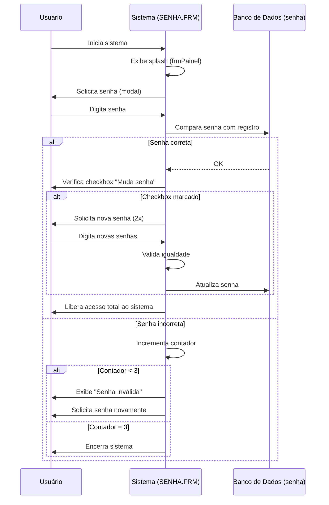

# Permissões — CDsLoc

> Gerado pelo Reversa em 2026-05-08
> Matriz de permissões e controle de acesso

---

## Visão Geral

O sistema CDsLoc utiliza um modelo de autenticação **simples baseado em senha única**:

- **Sem login individual por usuário**
- **Sem papéis (roles) diferenciados**
- **Sem controle de permissões granular por funcionalidade**
- **Acesso total após autenticação bem-sucedida**

Este é um padrão típico de sistemas monolíticos de desktop da época VB6.

---

## Fluxo de Autenticação



---

## Modelo de Acesso

### Tipos de Acesso

| Tipo | Descrição | Confiança |
|------|-----------|-----------|
| **Sem Acesso** | Sistema não inicializado (ainda não digitou senha) | 🟢 CONFIRMADO |
| **Acesso Total** | Após senha correta, usuário tem acesso a todas as funcionalidades | 🟢 CONFIRMADO |
| **Bloqueio** | Sistema encerrado após 3 tentativas falhas | 🟢 CONFIRMADO |

### Regras de Acesso

| Regra | Descrição | Confiança |
|--------|-----------|-----------|
| **Senha Única** | Sistema possui apenas uma senha global (tabela `senha`) | 🟢 CONFIRMADO |
| **Máximo 3 Tentativas** | Após 3 erros, sistema encerra automaticamente | 🟢 CONFIRMADO |
| **Troca de Senha** | Usuário pode alterar senha durante login | 🟢 CONFIRMADO |
| **Confirmação Obrigatória** | Nova senha deve ser digitada duas vezes de forma idêntica | 🟢 CONFIRMADO |
| **Limite de Tamanho** | Senha máxima de 10 caracteres | 🟢 CONFIRMADO |

---

## Matriz de Permissões

Como não há RBAC implementado, após login bem-sucedido **todas as funcionalidades** são acessíveis:

| Funcionalidade | Acesso (Autenticado) | Acesso (Não Autenticado) | Observação |
|---------------|------------------------|--------------------------|------------|
| **Login** | ✅ (troca de senha) | ❌ | Apenas para alterar senha |
| **Cadastro - Clientes** | ✅ Total | ❌ | Incluir, Alterar, Excluir |
| **Cadastro - Dependentes** | ✅ Total | ❌ | Incluir, Alterar, Excluir |
| **Cadastro - CDs (Títulos)** | ✅ Total | ❌ | Incluir, Alterar, Excluir |
| **Cadastro - CDs (Músicas)** | ✅ Total | ❌ | Incluir, Alterar, Excluir |
| **Cadastro - CDs (Físicos)** | ✅ Total | ❌ | Incluir, Alterar, Excluir |
| **Cadastro - Tabelas Auxiliares** | ✅ Total | ❌ | Intérpretes, Grupos, Estilos, Bairros, Municípios |
| **Movimentação - Locação** | ✅ Total | ❌ | Criar, Cancelar itens |
| **Movimentação - Devolução** | ✅ Total | ❌ | Baixar recibos |
| **Movimentação - Reservas** | ✅ Total | ❌ | Criar, Excluir, Consultar |
| **Consultas** | ✅ Total | ❌ | Todos os tipos de consulta |
| **Relatórios** | ✅ Total | ❌ | Todos os relatórios |
| **Alteração de Senha** | ✅ | ❌ | Durante login |
| **Encerrar Sistema** | ✅ | ❌ | Via menu "Finaliza" |

---

## Restrições de Negócio que Atuam como Permissões

Embora não seja RBAC, o sistema possui **restrições de negócio** que limitam ações:

| Restrição | Quando Aplica | Ação Bloqueada | Confiança |
|-----------|---------------|-----------------|-----------|
| **Cliente Cancelado** | Cliente com `cancelado = True` | Não pode fazer novas locações | 🟢 CONFIRMADO |
| | | Não pode fazer reservas | 🟢 CONFIRMADO |
| | | 🟡 Não pode cadastrar dependentes | 🟡 INFERIDO |
| **CD Locado** | CD com `situacao = "Locado"` | Não pode ser locado novamente | 🟢 CONFIRMADO |
| **Integridade Referencial** | Tentativa de excluir registro com dependentes | Exclusão bloqueada (erro 3200) | 🟢 CONFIRMADO |
| | | Exclusão bloqueada se há locações | 🟡 INFERIDO |

---

## Segurança de Senha

### Implementação Atual

| Aspecto | Detalhe | Avaliação de Segurança |
|----------|----------|-----------------------|
| **Algoritmo** | XOR com chave fixa 255 | 🔴 Muito inseguro (reversível) |
| **Hash** | Não utilizado | 🔴 |
| **Salt** | Não utilizado | 🔴 |
| **Armazenamento** | Texto codificado na tabela `senha` | 🔴 |
| **Validação de Força** | Não existe | 🔴 |
| **Expiração** | Não existe | 🔴 |
| **Histórico** | Não existe | 🔴 |
| **Bloqueio por Tentativas** | Sim (3 tentativas) | 🟡 Implementado mas fraco |

### Função de Criptografia

```vb
Private Function codigo(went)
    wsai = ""
    For i = 1 To Len(went)
       wsai = wsai & Chr(Asc(Mid(went, i, 1)) Xor 255)
    Next
    codigo = wsai
End Function
```

**Problemas:**
- XOR 255 é equivalente a NOT bit-a-bit
- Reversível: `codigo(codigo(x)) = x`
- Qualquer pessoa com acesso ao banco pode descobrir a senha

---

## Lacunas de Segurança (🔴)

| Lacuna | Descrição | Risco |
|--------|-----------|-------|
| **Sem Auditoria** | Não há registro de quem fez login ou alterou o que | 🔴 Qualquer ação é anônima |
| **Sem Logs de Acesso** | Não há histórico de acessos ao sistema | 🔴 Impossível investigar uso indevido |
| **Criptografia Fraca** | XOR é reversível, qualquer pessoa pode ler a senha | 🔴 Alto |
| **Separação de Papéis** | Todos têm acesso total após login | 🔴 Funcionário pode fazer exclusões indevidas |
| **Sem Controle de Sessão** | Uma vez logado, acesso permanece indefinidamente | 🔴 Usuário pode deixar estação desbloqueada |
| **Sem Confirmação para Ações Destrutivas** | Apenas MessageBox simples | 🟡 Erros podem ocorrer sem intenção |

---

## Recomendações (Não Implementadas)

As seguintes melhorias de segurança **não estão implementadas** no sistema:

| Recomendação | Descrição | Benefício |
|--------------|-----------|-----------|
| **RBAC (Role-Based Access Control)** | Criar papéis: Operador, Gerente, Administrador | 🔴 Limita acesso a funções sensíveis |
| **Hash de Senha** | Usar SHA-256 ou superior para armazenar senhas | 🔴 Impede recuperação de senhas |
| **Auditoria** | Registrar todas as ações importantes com usuário e timestamp | 🔴 Rastreabilidade |
| **Controle de Sessão** | Timeout automático após inatividade | 🔴 Reduz risco de acesso não autorizado |
| **Validação de Senha** | Exigir complexidade mínima | 🔴 Senhas mais fortes |
| **Múltiplos Usuários** | Login individual por operador | 🔴 Responsabilização |

---

## Nota sobre Autenticação

Devido à simplicidade da autenticação (senha única), o sistema assume que:

1. A estação onde o software roda é segura
2. Apenas pessoal autorizado tem acesso físico à estação
3. O operador que digita a senha é a pessoa responsável pelas ações

Este modelo era aceitável para **sistemas desktop monoposto** da década de 1990/2000, mas não atende requisitos de segurança modernos.
