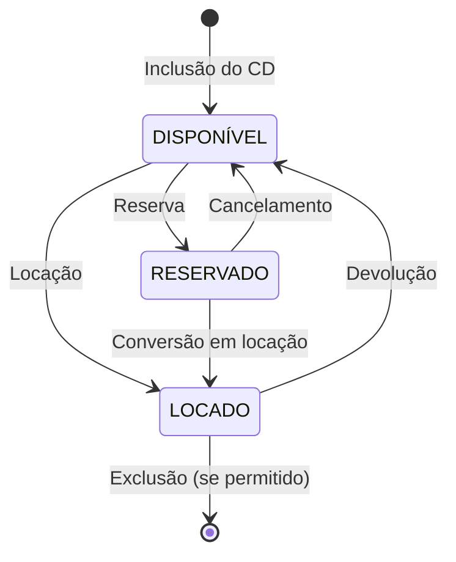
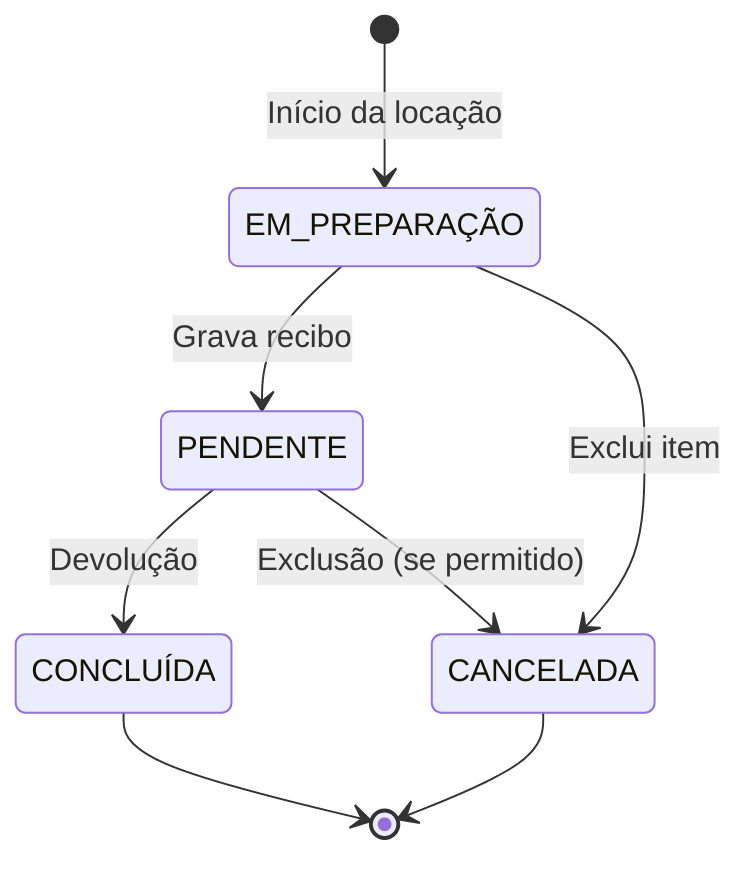
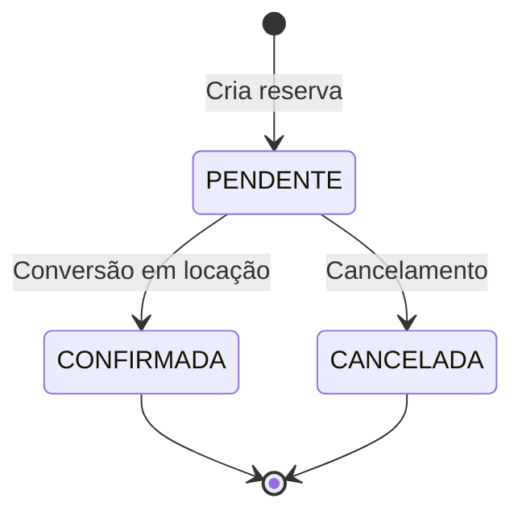
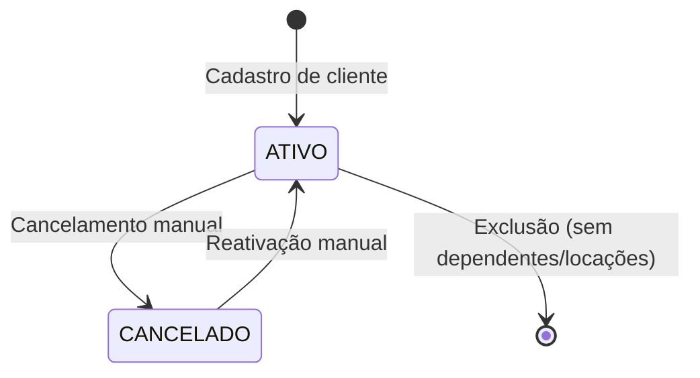
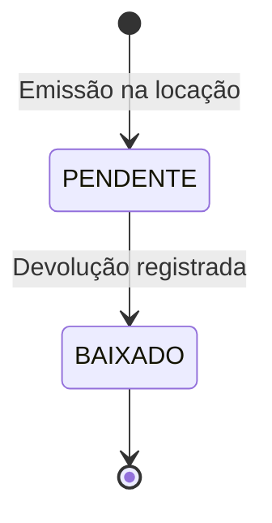

# Máquinas de Estado — CDsLoc

> Gerado pelo Reversa em 2026-05-08
> Máquinas de estado identificadas no sistema de locação de CDs

---

## Máquina de Estado: CD Físico

### Estados

| Estado | Descrição | Campo na Tabela |
|--------|-----------|------------------|
| **DISPONÍVEL** | CD está na locadora pronto para locação | `situacao = "Disponível"` ou `locado = False` |
| **LOCADO** | CD está com cliente | `situacao = "Locado"` ou `locado = True` |
| **RESERVADO** | 🟡 CD reservado para cliente (não confirmado no código) | 🟡 LACUNA |

### Transições

### Gatilhos e Regras

| Transição | Gatilho | Regras | Confiança |
|-----------|-----------|---------|-----------|
| **DISPONÍVEL → LOCADO** | Cliente realiza locação | Cliente deve estar ativo (não cancelado) | 🟢 CONFIRMADO |
| | | CD deve estar disponível | 🟢 CONFIRMADO |
| **LOCADO → DISPONÍVEL** | Cliente devolve CD | Verifica se há atraso para multa | 🟡 INFERIDO |
| | | Recibo é baixado (`devolvido = True`) | 🟢 CONFIRMADO |
| **DISPONÍVEL → RESERVADO** | Cliente faz reserva | Cliente deve estar ativo | 🟢 CONFIRMADO |
| | | Reserva é por título, não por CD específico | 🟢 CONFIRMADO |
| **RESERVADO → DISPONÍVEL** | Cancelamento de reserva | 🟢 CONFIRMADO |
| **RESERVADO → LOCADO** | Retirada do CD reservado | Reservado deve ter CD disponível | 🟡 INFERIDO |

---

## Máquina de Estado: Locação

### Estados

| Estado | Descrição | Campo na Tabela |
|--------|-----------|------------------|
| **EM PREPARAÇÃO** | Cliente selecionado, itens sendo adicionados | `locacao` não existe ainda |
| **PENDENTE** | Locação gravada, recibo emitido, não devolvido | `locacao.situacao = "Locado"`, `recibo.devolvido = False` |
| **CONCLUÍDA** | CD devolvido, recibo baixado | `locacao.situacao = "Devolvido"`, `recibo.devolvido = True` |
| **CANCELADA** | Item removido do recibo antes de confirmar | Registro excluído de `locacao` |

### Transições

### Gatilhos e Regras

| Transição | Gatilho | Regras | Confiança |
|-----------|-----------|---------|-----------|
| **EM_PREPARAÇÃO → PENDENTE** | Botão "Grava" clicado | Valida todos os campos obrigatórios | 🟢 CONFIRMADO |
| | | Confirma com usuário | 🟢 CONFIRMADO |
| **EM_PREPARAÇÃO → CANCELADA** | Item excluído da lista | Atualiza estado do CD para DISPONÍVEL | 🟢 CONFIRMADO |
| | | Restaura estoque do título | 🟡 INFERIDO |
| **PENDENTE → CONCLUÍDA** | Devolução registrada | Verifica recibo pendente do cliente | 🟢 CONFIRMADO |
| | | Atualiza data_devolucao | 🟢 CONFIRMADO |
| | | Marca recibo como devolvido | 🟢 CONFIRMADO |
| **PENDENTE → CANCELADA** | 🟡 LACUNA | 🟡 LACUNA (não há código explícito) |

---

## Máquina de Estado: Reserva

### Estados

| Estado | Descrição | Campo na Tabela |
|--------|-----------|------------------|
| **PENDENTE** | Reserva criada, aguardando retirada | `reserva.situacao = "Pendente"` |
| **CONFIRMADA** | Reserva convertida em locação | `reserva.situacao = "Confirmada"` |
| **CANCELADA** | Reserva cancelada | Registro excluído |

### Transições

### Gatilhos e Regras

| Transição | Gatilho | Regras | Confiança |
|-----------|-----------|---------|-----------|
| **PENDENTE → CONFIRMADA** | Sistema detecta reserva ao locar | Sistema verifica reservas do cliente | 🟢 CONFIRMADO |
| | | Conversão automática ao criar locação | 🟡 INFERIDO |
| **PENDENTE → CANCELADA** | Botão "Excluir" ou "Deletar Registro" | 🟡 Deletar remove reservas já locadas | 🟢 CONFIRMADO |
| | | Excluir remove reserva individual | 🟢 CONFIRMADO |

---

## Máquina de Estado: Cliente

### Estados

| Estado | Descrição | Campo na Tabela |
|--------|-----------|------------------|
| **ATIVO** | Cliente pode fazer locações e cadastrar dependentes | `cancelado = False` |
| **CANCELADO** | Cliente bloqueado para novas operações | `cancelado = True` |

### Transições

### Gatilhos e Regras

| Transição | Gatilho | Regras | Confiança |
|-----------|-----------|---------|-----------|
| **ATIVO → CANCELADO** | Botão "Cancelar" marcado | Cliente não pode fazer novas locações | 🟢 CONFIRMADO |
| | | Cliente não pode cadastrar dependentes | 🟡 INFERIDO |
| | | Mensagem "O Cliente está CANCELADO" exibida | 🟢 CONFIRMADO |
| **CANCELADO → ATIVO** | Desmarcar opção "Cancelar" | 🟡 LACUNA (não há código explícito de reativação) |
| **ATIVO → [*] (Exclusão)** | Botão "Excluir" clicado | 🟡 LACUNA (código de exclusão presente mas lógica incompleta) |

---

## Máquina de Estado: Recibo

### Estados

| Estado | Descrição | Campo na Tabela |
|--------|-----------|------------------|
| **PENDENTE** | Recibo emitido, aguardando devolução | `devolvido = False` |
| **BAIXADO** | Devolução registrada | `devolvido = True` |

### Transições

### Gatilhos e Regras

| Transição | Gatilho | Regras | Confiança |
|-----------|-----------|---------|-----------|
| **[*] → PENDENTE** | Locação confirmada | Sistema calcula valor total | 🟡 INFERIDO |
| | | Recibo registrado na tabela `recibo` | 🟢 CONFIRMADO |
| **PENDENTE → BAIXADO** | Cliente devolve CDs | Verifica recibos pendentes do cliente | 🟢 CONFIRMADO |
| | | Se múltiplos, usuário seleciona | 🟢 CONFIRMADO |
| | | Marca recibo como devolvido | 🟢 CONFIRMADO |

---

## Observações sobre Máquinas de Estado

### Sincronização Entre Estados

Alguns eventos afetam múltiplas entidades simultaneamente:

| Evento | CD Físico | Título | Locação | Recibo |
|---------|-----------|---------|----------|---------|
| **Nova Locação** | LOCADO | `qtde_disp` - 1 | PENDENTE | PENDENTE |
| **Cancelamento de Item** | DISPONÍVEL | `qtde_disp` + 1 | CANCELADA | - |
| **Devolução** | DISPONÍVEL | `qtde_disp` + 1 | CONCLUÍDA | BAIXADO |

### Estados Não Implementados

| Estado | Descrição | Por que não implementado |
|--------|-----------|----------------------|
| **RESERVADO (CD)** | Marcar CD físico como reservado | 🟡 Sistema reserva por título, não por CD |
| **ATRASADO (Locação)** | Marcar locação como em atraso | 🟡 Sistema calcula atraso mas não marca estado |

---

## Lacunas nas Máquinas de Estado (🔴)

| Lacuna | Descrição | Impacto |
|--------|-----------|---------|
| **Sem estado "RESERVADO" no CD** | Código não mostra CDs reservados nas consultas | 🔴 Usuário não sabe quais CDs estão reservados |
| **Sem reativação de cliente** | Uma vez cancelado, não há código para reativar | 🔴 Cliente cancelado precisa ser excluído e recadastrado |
| **Estado "ATRASADO" não existe** | Sistema não marca locações com atraso | 🔴 Relatórios de atraso podem não funcionar |
| **Transição de reserva para locação** | Código de conversão não está claro | 🔴 Pode haver duplicação de registros |
